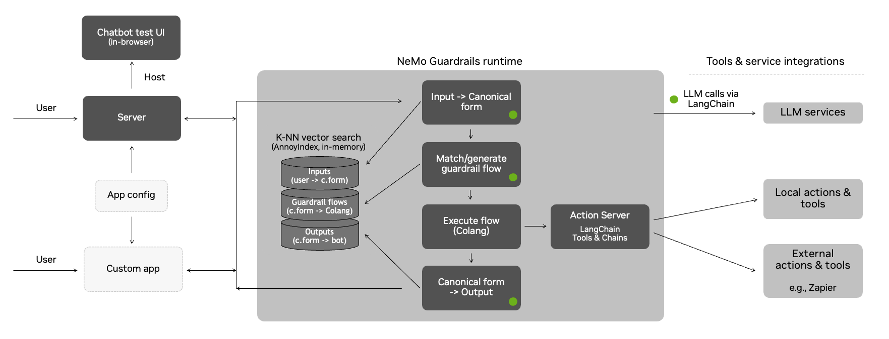
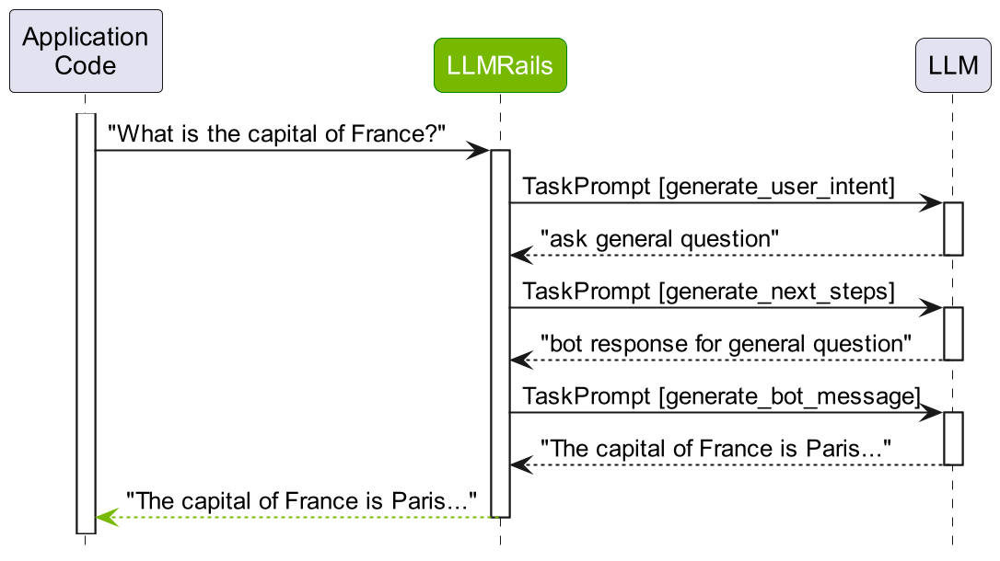

# NeMo Guardrails Documentation


# Architecture



# Core Concepts

Colang is a modeling language for conversational applications. In Colang, the two core concepts are: **messages** and **flows**.

### Messages

An exchanged **message** has an **utterance**, e.g. *"What can you do?"*, and a **canonical form**, e.g. `ask about capabilities`. A canonical form is a paraphrase of the utterance to a standard, usually shorter, form.

```text
define user express greeting    <- canonical form
  "Hello"          <- utterance
  "Hi"             <- utterance
  "Wassup?"        <- utterance

define bot express greeting     <- canonical form
  "Hey there!"   <- utterance
```

### Flows

**Flows** represent patterns of interaction between the user and the bot. In their simplest form, they are sequences of user and bot messages. 

```text
define flow greeting
  user express greeting
  bot express greeting
```

To get more visibility on what happens under the hood, we will make use of the *explain* feature that the `LLMRails` class provides.

```python
# We fetch the latest `ExplainInfo` object using the `explain` method.
info = rails.explain()

# Check the history of the conversation
print(info.colang_history) # shows the exact messages and their canonical forms

# Check the actual LLM calls that have been made
info.print_llm_calls_summary()

info.llm_calls # attribute with detailed information about each LLM call
```

### Process



Once an input message is received from the user, a multi-step process begins.

**Step 1: compute user message canonical form** 

By default, the LLM itself is used to perform this task. Uses `generate_user_intent` task prompt template.

> NOTE: NeMo Guardrails uses a task-oriented interaction model with the LLM. The default template prompts can be found [here](https://github.com/NVIDIA/NeMo-Guardrails/blob/develop/nemoguardrails/llm/prompts/general.yml).

- task prompt template
    
    The prompt has four/five logical sections:
    
    1. A set of general instructions. These can [be configured](https://github.com/NVIDIA/NeMo-Guardrails/blob/develop/docs/user_guides/configuration-guide.md#general-instructions) using the `instructions` key in `config.yml`.
    2. A sample conversation, which can also [be configured](https://github.com/NVIDIA/NeMo-Guardrails/blob/develop/docs/user_guides/configuration-guide.md#sample-conversation) using the `sample_conversation` key in `config.yml`.
    3. (if context is inserted) Relevant chunks for context
    4. A set of examples for converting user utterances to canonical forms. The top five most relevant examples are chosen by performing a vector search against all the user message examples. 
    5. The current conversation preceded by the first two turns from the sample conversation.

**Step 2: decide next step**

The guardrails instance needs to decide what should happen next. There are two cases:

1. If there is a **flow** that matches the canonical form, then it will be used. The flow can decide that the bot should respond with a certain message, or execute an action.
2. If there is no flow, the LLM is prompted for the next step, i.e. the `generate_next_step` task.

**Step 3: generate bot message**

Once the canonical form for what the bot should say has been decided, the actual message needs to be generated. And here we have two cases as well:

1. If a predefined message is found, the exact utterance is used.
2. If a predefined message does not exist, the LLM will be prompted to generate the message, i.e. the `generate_bot_message` task.


> If no user canonical forms are defined for the Guardrails configuration, instead of using the `generate_user_intent` task as a first phase,  the `general` task is used.


# Rails

NeMo Guardrails supports five main types of guardrails:


1. **Input rails**: applied to the input from the user; an input rail can reject the input, stopping any additional processing, or alter the input (e.g., to mask potentially sensitive
data, to rephrase).
2. **Output rails**: applied to the output generated by the LLM; an output rail can reject the output, preventing it from being returned to the user, or alter it (e.g., removing sensitive data).
3. **Execution rails**: applied to input/output of the **custom actions** (a.k.a. tools), that need to be called by the LLM.
4. **Dialog rails**: influence how the LLM is prompted; dialog rails operate on canonical form  messages (more details [here](https://github.com/NVIDIA/NeMo-Guardrails/blob/develop/docs/user_guides/colang-language-syntax-guide.md)) and determine if an action should be executed, if the LLM should be invoked to generate the next step or a response, if a predefined response should be used instead, etc. 
5. **Retrieval rails**: applied to the retrieved chunks in the case of a **RAG** (Retrieval Augmented  Generation) scenario; a retrieval rail can reject a chunk, preventing it from being used to prompt the LLM, or alter the relevant chunks (e.g., to mask potentially sensitive data).

## Use Cases for Rails

[Guide: Use Cases for Rails](pages/use_cases_for_rails.md)
# Setup and Deployment

## Model Setup

[Guide: LLM Providers](pages/providers.md)

## Setting up the Server

[Guide: Server Setup and Deployment](pages/server_setup_and_deployment.md)

## Defining Configuration Settings

[Guide: Configuration](pages/configuration_guide.md)

## API
[Guide: API](pages/api_guide.md)

# Watched Issues

- https://github.com/NVIDIA/NeMo-Guardrails/pull/256
- https://github.com/NVIDIA/NeMo-Guardrails/issues/224
- https://github.com/NVIDIA/NeMo-Guardrails/issues/227